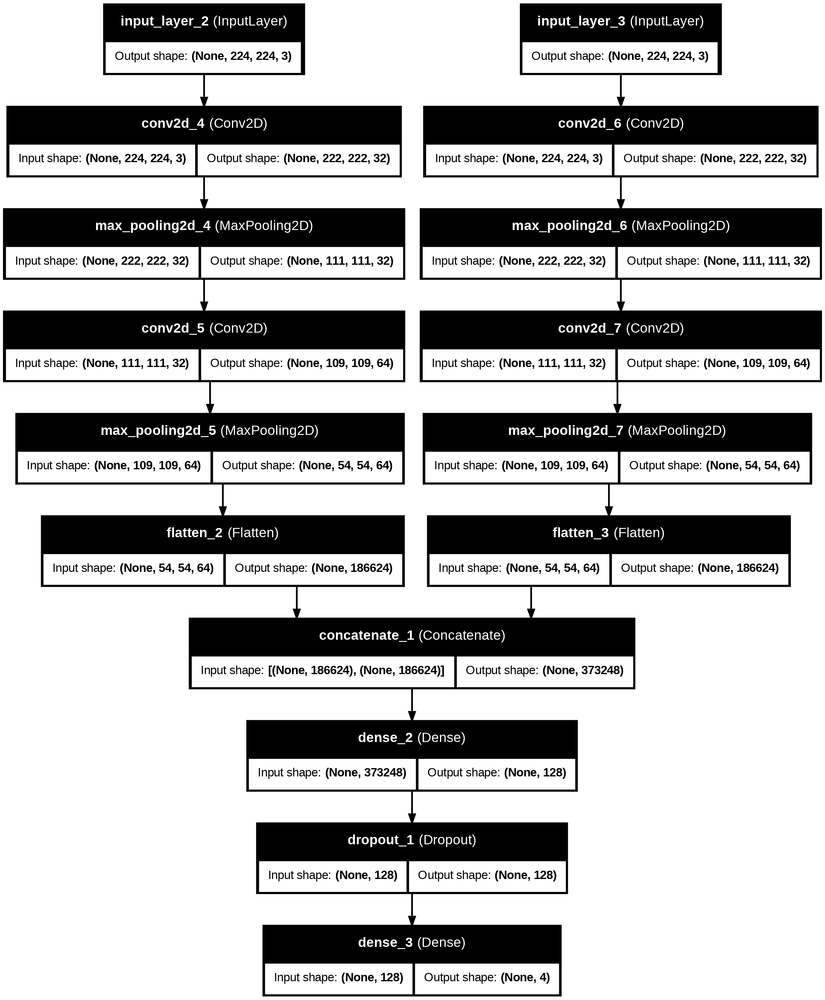
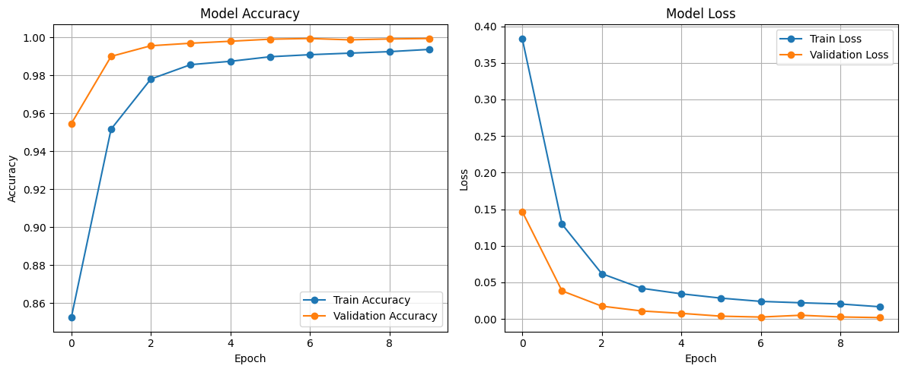

# Early-Detection-of-Alzheimer

---

##  How It Works

### 1. **Load Data**
- Two input feature sets (`X1.npy`, `X2.npy`) and corresponding labels (`y.npy`).
- Data is normalized and split into training/testing sets.

### 2. **Dual-Stream CNN Architecture**
- Two separate CNN pipelines extract features from `X1` and `X2`.
- Feature maps are flattened and concatenated.
- Dense layers finalize classification using softmax.

- Model Architecture:

### 3. **Training & Evaluation**
- Trained using Adam optimizer and categorical cross-entropy.
- Accuracy and loss are plotted for both training and validation.
- Final performance is evaluated on the test set.

---

## 📈 Results

- Confusion Matrix:

---

- Accuracy and Loss Graph:

